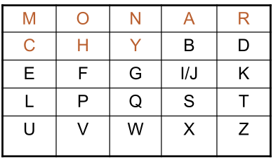

# Playfair Cipher

Playfair Cipher is the poly-aplphabetic cipher technique.
In this a 5X5 matrix is used for encrypting/decrypting each letters.

Here is a default example of Playfair Cipher:

Encryption in Playfair Cipher

For a given texts, select two letters at a time:

1. If two letter is same, insert filler like "X".

Example: for AA ---> AX

2. If both letters fall in same row, replace each with the letter below it. (wrapping back to start from end)

Example: for MO ---> ON

3. If both letters fall in same column, replace each with the letter below it. (wrappinng to top from bottom)
 
Example: for LU ---> UM

4. Else, each letter is replaced by the letter in the same row and in the column of the other letter of the pair. 

Example: for MY ---> NC.

Deccryption in Playfair Cipher.

It is the opposite Steps of all 4 encryption operation.

Security: It has improved security as there is chance of 26*26 = 676 entries.

